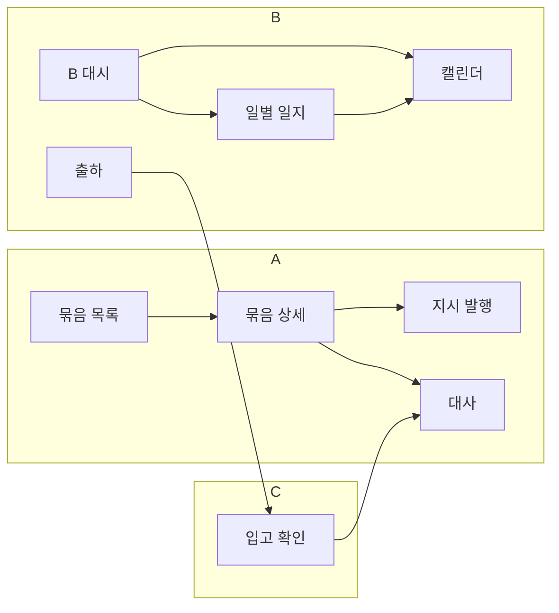

# 화면 인벤토리 (전체 창 목록)

**목표:** UI mockup만 구현. 각 창의 상세 스펙은 링크된 `pages/*.md` 참고.

**업무 흐름 요약**

1. A — **여러 자재 묶음**을 B에 보냄 + **묶음별 사용 기간**(최대 기한)
2. A — 같은 묶음에 대해 **여러 번** “x일까지 y개” **기간 지시** (+ comment)
3. B — A가 준 기간 동안 **매일** 현장 일지 업로드 (생산·불량·원재료·QC·비고·첨부)
4. B — C로 **출하** 주장
5. C — **입고** 개수 확인
6. A — **대사·수율** (기간 달성 · B↔C · 묶음 최종)

---

## 역할별 창 맵

```
[A Desktop]                          [B Desktop]                    [C Mobile]
─────────────────                    ─────────────────              ─────────────
Dashboard (묶음 요약)                 B Dashboard (묶음·지시)         입고 목록 /m
자재 묶음 목록·상세                   일별 생산 일지 ★                QR 스캔
기간 지시 발행·목록                   생산 캘린더·그래프 ★            입고 확인
(ERP: WO/PO 등)                      C 출하 등록                     차이 처리
대사·수율
```

★ = 이번 대화에서 확장된 B 핵심 UI

---

## A업체 — 필요한 창

| # | 화면명 | 목적 | 스펙 문서 | 예정 경로 |
|---|--------|------|-----------|-----------|
| **A0** | **작업 현황 (Command Center)** ★ | 제품 라인·묶음·지시 기간 전환, 입고 달성 | [structure-workshop-ab-material-flow.md](./structure-workshop-ab-material-flow.md) | `/operations/command-center` |
| A1 | **대시보드** | legacy WO 요약 | [bundle-operations-overview.md](./bundle-operations-overview.md) | `/dashboard` |
| A2a | **원자재 출하 등록** | 로션/토너별 출하 라인 | structure-workshop | `/operations/material-shipment` |
| A9 | **A→B 이송 대조** | 출하 건 vs B7 | structure-workshop | `/operations/transit-reconciliation` |
| A4 | **기간 지시 목록** | 전사 지시 테이블 | [a-period-directives.md](./a-period-directives.md) | `/operations/directives` |
| A13 | **예외 큐** | 대사·transit 이슈 | mock | `/operations/exceptions` |
| — | **제품 라인** | SKU family | structure-workshop | `/operations/product-lines` |
| A2 | **자재 묶음 목록** | 다건 동시 진행, 출하·기한·누적 입고 | [a-material-bundles.md](./a-material-bundles.md) | `/operations/material-bundles` |
| A3 | **자재 묶음 생성** | 생산 가능 수량, 목표, **사용 기간**, 출하 기록 | [a-material-bundles.md](./a-material-bundles.md) §2 | `.../material-bundles/new` |
| A3b | **자재 묶음 상세** | 타임라인, 탭(지시·일지·출하·대사) | [a-material-bundles.md](./a-material-bundles.md) §3 | `.../material-bundles/[id]` |
| A4 | **기간 지시 목록** | v1: A3b/A1 embed · v2: 전사 `/directives` | [a-period-directives.md](./a-period-directives.md) | `/operations/directives` (v2) |
| A5 | **기간 지시 발행** | dueDate, y, C출하, **comment** | [a-period-directives.md](./a-period-directives.md) | 모달 또는 `.../directives/new` |
| A6 | **대사·수율** | Directive 달성 · B↔C · 묶음 최종 | [reconciliation-yield.md](./reconciliation-yield.md) | `/operations/reconciliation` |
| **A10** | **기간 지시 실적 분석** ★ | 지시 1건 = 케이스 · 기간 내 생산/출하/입고 **그래프** (A only) | [a-directive-period-analytics.md](./a-directive-period-analytics.md) | `/operations/directive-analytics` |
| A7 | ERP (기존 mock) | **MVP UI 범위 밖** (v2) | [WORKSHOP-2026-06-03.md](./WORKSHOP-2026-06-03.md) | `/erp/*` (데모만) |
| A8 | Admin (기존) | Users, Settings, Audit | PROJECT | `/admin/*` |

**A에서 꼭 넣을 UI 요소 (묶음·지시)**

- 묶음: **사용 기간** (`useByDate` / 시작~종료)
- 지시: **comment** textarea + 목록 truncate + 상세 전문
- 목록: **여러 active 묶음** 동시 표시

---

## B업체 — 필요한 창

| # | 화면명 | 목적 | 스펙 문서 | 예정 경로 |
|---|--------|------|-----------|-----------|
| B1 | **B 대시보드** | 담당 묶음, 다가오는 지시+comment, 오늘 일지 미작성 | [bundle-operations-overview.md](./bundle-operations-overview.md) | `/operations/bundles` |
| ~~B1b~~ | B 묶음 overview | **v1 통합→B1** · v2 read-only `/bundles/[id]` | [WORKSHOP-2026-06-03.md](./WORKSHOP-2026-06-03.md) | — |
| B2 | **일별 생산 일지** ★ | **오늘(또는 선택일)** 현장 입력·첨부 | [b-daily-production-log.md](./b-daily-production-log.md) | `/operations/daily-log` |
| B3 | **생산 캘린더·추이** | 히트맵·주간 그래프·지시 카드 | [b-production-calendar.md](./b-production-calendar.md) | `/operations/production-calendar` |
| B4 | **일지 이력·검토** (B Admin) | 날짜별 제출 목록, 첨부 보기, 수정 승인 | [b-daily-production-log.md](./b-daily-production-log.md) §이력 | `/operations/daily-log/history` |
| B5 | **C 출하 등록** | 발송 수량·출하 번호·지시 연계 | [b-shipment-to-c.md](./b-shipment-to-c.md) | `/operations/shipments` (확장) |
| **B7** | **원재료 입고 확인** ★ | A출하 vs B실수령 (transit loss) | [b-material-receipt.md](./b-material-receipt.md) | `/operations/material-receipt` |
| B6 | **지시 읽기** | embedded only (v1) | [a-period-directives.md](./a-period-directives.md) | B1 / B2 컨텍스트 |

**B 일별 일지 — 필수 입력 (이번 요구)**

| 필드 | UI |
|------|-----|
| 오늘 생산 수량 | number |
| 오늘 불량 수량 | number |
| 오늘 사용 원재료 | 복수 라인 또는 요약 + 상세 (아래 스펙) |
| 오늘 QC 샘플 수량 | number |
| 비고 | textarea |
| 사진/파일 | file upload (다중) |

---

## C창고 — 필요한 창 (기존 + 연계)

| # | 화면명 | 스펙 | 경로 |
|---|--------|------|------|
| C1 | 입고 목록 | [c-mobile-receiving.md](./c-mobile-receiving.md) | `/m` |
| C2 | QR 스캔 | 동일 | `/m/receiving/scan` |
| C3 | 입고 수량 확인 | 동일 | `/m/receiving/[id]` |
| C4 | 차이 처리 | 동일 | `/m/discrepancy/[id]` |

---

## 창 간 이동 (IA)



---

## 구현 우선순위 (UI mock)

워크숍 반영: [WORKSHOP-2026-06-03.md](./WORKSHOP-2026-06-03.md)

| 순서 | 창 | 이유 |
|------|-----|------|
| 1 | A2–A3b 묶음 | 다건·기간·탭 |
| 2 | A5 + **A10** + B1 (지시 · 출하/입고 progress) | A 그래프 · B/C 입력 반영 |
| 3 | B2 일별 일지 | 매일 입력 |
| 4 | **B7 입고 확인** | A→B loss |
| 5 | B5 · C1–C3 | 출하·입고 |
| 6 | A6 · A1 | 대사·대시 |
| 7 | B3 · B4 | 캘린더·검토 |

---

## 기존 mock 화면과 매핑

| 기존 (코드 있음) | 목표 창 | 조치 |
|------------------|---------|------|
| `/dashboard` | A1 | 묶음 다건 KPI로 확장 |
| `/operations/orders` | A2 일부 | WO → Bundle 전환 또는 병행 |
| `/operations/production` | B2 | **일별 일지로 대체·확장** |
| `/operations/shipments` | B5 | 묶음·지시 연계 |
| `/operations/reconciliation` | A6 | 탭 확장 |
| `/m/*` | C1–C4 | 유지 |

---

## 문서 추가·수정 이력

| 파일 | 내용 |
|------|------|
| [b-daily-production-log.md](./b-daily-production-log.md) | **신규** — 일별 일지 전체 UI |
| [b-shipment-to-c.md](./b-shipment-to-c.md) | **신규** — B 출하 |
| [b-production-calendar.md](./b-production-calendar.md) | 일지와 역할 분리 반영 |
| [domain/material-bundles-and-flow.md](../domain/material-bundles-and-flow.md) | DailyLog 엔티티 확장 |
