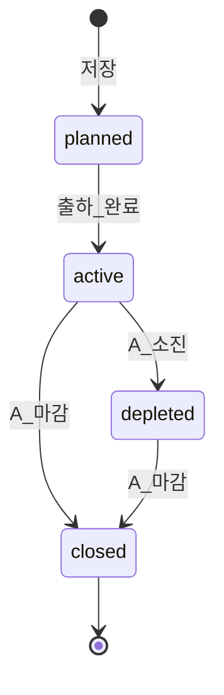

# A — 자재 묶음 (Material Bundles)

**역할:** Super Admin (A)  
**예정 경로:** `/operations/material-bundles` · 생성 `/operations/material-bundles/new` · 상세 `/operations/material-bundles/[id]`  
**B Admin (overview):** `/operations/bundles/[id]` — 레이아웃·역할이 달라 **별도 URL** (§3.0)  
**목적:** 여러 자재 묶음의 **전체 진행·수율·대사**를 한곳에서 **조회**. 생산·일지·출하 **입력은 전용 화면**에서.

**연관:** 기간 지시 [a-period-directives.md](./a-period-directives.md) · B 일지 [b-daily-production-log.md](./b-daily-production-log.md) · 대사 [reconciliation-yield.md](./reconciliation-yield.md)

---

## 0. 화면 역할 (overview vs 입력)

| 구분 | 이 화면 (묶음 overview) | 전용 입력 화면 |
|------|-------------------------|----------------|
| A | 묶음 등록·메타 편집·출하 완료·마감 | 지시 발행 → **모달** (또는 [directives](./a-period-directives.md)) |
| B | 진행·지시·수율 **조회** (`/operations/bundles/[id]`) | [일별 일지](./b-daily-production-log.md) · [출하](./b-shipment-to-c.md) · [캘린더](./b-production-calendar.md) |
| 공통 | 도넛·타임라인·탭으로 **현황** 확인 | 탭 데이터 없음 → 「정보가 입력되지 않았습니다.」 + 해당 화면 링크 |

---

## v1 UX 결정 (mock)

| 항목 | v1 |
|------|-----|
| 화면 성격 | **Overview** — 입력·생산 기록 UI는 이 창에 두지 않음 |
| 새 묶음 | **전용 페이지** `/material-bundles/new` |
| 목록 → 상세 | **행 클릭 → 상세 페이지** (`/[id]`). 우측 빠른 보기 패널 **v1 생략** |
| 상세 상단 | **도넛 2개 좌우** (E2E · Production) + KPI 4칸 + 다음 지시 1줄 |
| 상세 기본 탭 | **대사** |
| 지시 발행 | **모달** (묶음 pre-fill) |
| 섹션 UI | **Notion형** — 좌측 `---` 아웃라인 · 클릭 시 해당 섹션으로 스크롤 · 제목 클릭 접기/펼치기 (무거운 Card 감싸기 X) |
| 상세 편집 | **섹션별 「편집」** (기본 정보 / 출하 각각). `closed` 시 편집 버튼 숨김 |
| 타임라인 | **접이 Stepper** — 기본 최근 5건, 「전체 이력」 펼치기 |
| 상태 Badge | **i18n** (예: KO 예정·진행중·소진·마감) + 색 (§1.8) |
| B Admin | **별도 URL** `/operations/bundles/[id]` (read-only overview) |
| 사용 기간 | `useByDate` 필수 · `useFromDate` 선택 |
| CSV | v2 |

---

## 1. 목록 화면 (A)

### 1.1 페이지 레이아웃

```
┌──────────────────────────────────────────────────────────────────┐
│ 헤더: 자재 묶음 · [+ 새 묶음]                                      │
├──────────────────────────────────────────────────────────────────┤
│ KPI 스트립 (4칸)                                                  │
├──────────────────────────────────────────────────────────────────┤
│ 필터: 상태 · SKU · B업체 · 기한 · 검색                             │
│ 칩: [진행 중 N건] [기한 임박 M건]                                   │
├──────────────────────────────────────────────────────────────────┤
│ 테이블 (active 우선, use-by 가까운 순) · 행 클릭 → /[id]            │
└──────────────────────────────────────────────────────────────────┘
```

### 1.2 페이지 헤더

| 요소 | 내용 |
|------|------|
| 제목 | 자재 묶음 |
| 설명 | B로 보낸 원자재 패키지별 목표·기한·진행 **현황** |
| 액션 | `+ 새 묶음` → `/operations/material-bundles/new` |

### 1.3 필터 바

| 필터 | 타입 | 옵션 |
|------|------|------|
| 상태 | multi-select | 전체 · planned · active · depleted · closed |
| SKU | 검색/선택 | Item master (완제품) |
| B 업체 | select | vendor |
| 기한 | date range | `useFromDate`~`useByDate` |
| 검색 | text | 묶음 번호, WO/PO 참조 |

필터 변경 시 **즉시 적용** (mock). 테이블 **액션 버튼** 클릭 시 행 클릭(상세 이동) **발생하지 않음** (`stopPropagation`).

### 1.4 KPI 스트립 (4칸)

| KPI | 계산 |
|-----|------|
| Active 묶음 수 | `status = active` count |
| 이번 달 출하 묶음 | `shippedAt` in month |
| 입고 대기 출하 | Σ(B shipped − C received) > 0 건수 |
| 평균 E2E yield | active+closed의 `receivedAtCTotal / targetQty` 평균 |

숫자: 천 단위 콤마 · 수율 소수 **1자리** (예: `74.5%`).

### 1.5 메인 — 테이블

| 컬럼 | 정렬 | 설명 |
|------|------|------|
| 묶음 번호 | ✓ | `MB-2026-001` → 상세 |
| SKU / 제품명 | ✓ | |
| 생산 가능 수량 | right | `theoreticalQty` (UI: KO 생산 가능 수량 · EN Theo. Output · ZH 可生产数量) |
| 목표 | right | `targetQty` |
| 사용 기간 | ✓ | `useFromDate ~ useByDate` · D-day (§1.7) |
| 누적 생산 | right | `producedTotal` |
| C 입고 | right | `receivedAtCTotal` |
| E2E 수율 | right | `received / target` % · hover: Production yield |
| 상태 | | Badge (§1.8) |
| 액션 | | `지시 발행`(모달) · `상세` |

**행 클릭:** `/operations/material-bundles/[id]`.

**행 스타일:** `active` + 기한 경과 → warning tint + ⚠ · `at_risk` (진행 <50% & D-day ≤7) → 주황 행 tint (별도 컬럼 없음).

### 1.6 D-day 뱃지

| 조건 | 스타일 | 라벨 예 |
|------|--------|---------|
| D-day > 7 | — | — |
| 1 ≤ D-day ≤ 7 | warning | `D-5` |
| D-day = 0 | warning | `D-day` |
| D-day < 0 | critical | `+3일 경과` |

### 1.7 상태 Badge (i18n + 색)

| status | KO | EN (예) | 색 |
|--------|-----|---------|-----|
| `planned` | 예정 | Planned | gray |
| `active` | 진행중 | Active | green |
| `depleted` | 소진 | Depleted | amber |
| `closed` | 마감 | Closed | blue |

언어 전환 시 라벨만 바뀌고 `status` 키는 동일.

---

## 2. 생성 화면 (`/material-bundles/new`)

A 전용 **등록** 화면 (overview 상세와 분리). 저장 후 A 상세 `/[id]` 이동.

### 2.1 레이아웃

```
┌──────────────────────────────────────────────────────────┐
│ ← 목록    새 자재 묶음 · (저장 시 MB-번호 자동 생성 안내)      │
├──────────────────────────────────────────────────────────┤
│ 기본 정보 (2열 grid)                                       │
│ 원자재 출하 (2열)                                          │
├──────────────────────────────────────────────────────────┤
│ [저장]  [저장 후 출하 완료 → active]  [취소]                │
└──────────────────────────────────────────────────────────┘
```

### 2.2 기본 정보 — 2열 grid

```
[ SKU              ] [ B 업체           ]
[ 생산 가능 수량   ] [ 목표             ]
[ 사용 시작일      ] [ 최대 사용 기한   ]
[ PO / WO 참조     ] ( colspan 2 )
[ 메모 (내부)      ] ( colspan 2, textarea )
```

| 필드 | 입력 | 필수 | 비고 |
|------|------|------|------|
| SKU | select | ✓ | Item Master 완제품 |
| 생산 가능 수량 | number | ✓ | SKU 선택 시 BOM 자동 · 수동 수정 가능 (`theoreticalQty`) |
| 목표 | number | ✓ | ≤ n |
| 사용 시작일 | date | | 미입력 → 생성일 |
| 최대 사용 기한 | date | ✓ | `useByDate` |
| B 업체 | select | ✓ | 1묶음 = 1 B |
| PO/WO | text | | mock: 자유 텍스트 + ERP 링크 |
| 메모 | textarea | | A 내부만 |

**묶음 번호:** 입력칸 없음. **저장 시** `MB-YYYY-NNN` 자동 부여.

### 2.3 원자재 출하 (v1)

```
[ 환산 출하량    ] [ 출하일         ]
```

| 필드 | 필수 | 설명 |
|------|------|------|
| `materialShipQty` | | 완제품 환산 출하량 |
| `shippedAt` | 출하 완료 시 ✓ | 없으면 `planned` |

### 2.4 유효성 · 저장

| 규칙 | 처리 |
|------|------|
| `targetQty ≤ theoreticalQty` | block |
| `useFromDate ≤ useByDate` | block |
| 출하 완료 without 출하일 | block |

| 버튼 | 결과 |
|------|------|
| 저장 | `planned` → `/[id]` |
| 저장 후 출하 완료 | `active` → `/[id]` |
| 취소 | confirm → 목록 |

---

## 3. 상세 overview (`/material-bundles/[id]` — A)

**조회 중심.** 생산·일지·출하 **입력 UI 없음** — 탭은 read-only + 전용 화면 링크.

### 3.0 B Admin 상세 (`/operations/bundles/[id]`)

A 상세와 **다른 URL·레이아웃**. 동일 데이터, 차이:

| | A `/material-bundles/[id]` | B `/operations/bundles/[id]` |
|--|---------------------------|------------------------------|
| 편집 | 섹션별 편집 (A) | **없음** |
| 헤더 액션 | 출하 완료·마감·지시 모달 | **없음** (착수 확인은 [B 보드](./bundle-operations-overview.md) 카드) |
| CTA | 지시·대사 | **일지 작성** · **출하 등록** · 캘린더 (입력 화면으로) |
| 도넛·탭 | 동일 | 동일 (read-only) |

### 3.1 페이지 레이아웃 (Notion형)

```
┌────────┬─────────────────────────────────────────────────────────┐
│ outline│ ← 목록  MB-001 · Serum · [진행중]  [지시][출하][마감]      │
│        ├─────────────────────────────────────────────────────────┤
│ --- 요약│ [도넛 E2E]  [도넛 Production]  │ KPI×4 │ 다음 지시 1줄   │
│ --- 기본│ ▼ 기본 정보          [편집]                              │
│ --- 출하│ ▼ 원자재 출하        [편집]                              │
│ --- 이력│ ▼ 타임라인 (최근 5 · 전체 이력)                           │
│ --- 상세│ ▼ 탭 [대사*|지시|일지|출하]  *기본 선택                   │
└────────┴─────────────────────────────────────────────────────────┘
```

**좌측 outline (`---`)**

- 각 항목 클릭 → 해당 섹션 **맨 위로 스크롤** (sticky outline, v1 간단 anchor).
- 섹션 **제목 행** 클릭 → 접기/펼치기. Card border 강조 없이 **구분선 + 여백**만.
- 접힌 상태: 제목 + 한 줄 요약만 (예: 기본 정보 → `Serum · 목표 1,100 · ~9/30`).

### 3.2 상단 요약 — 도넛 2개 (좌우)

| 위치 | 차트 | 값 | 중앙 라벨 |
|------|------|-----|-----------|
| **좌** | **도넛** E2E | `receivedAtCTotal / targetQty` | `74.5%` · `820 / 1,100` |
| **우** | **도넛** Production | `producedTotal / targetQty` | `76.4%` · `840 / 1,100` |

- 채움 arc = 달성률 · 나머지 = muted track.
- 하단 작은 캡션: 좌 `C 입고 / 목표` · 우 `누적 생산 / 목표` (i18n).
- `targetQty = 0` 또는 데이터 없음 → empty ring + `—`.

**요약 바 나머지 (도넛 우측 또는 아래 1행):**

| KPI 칸 | 값 |
|--------|-----|
| 목표 | `targetQty` |
| 누적 생산 | `producedTotal` |
| B→C 출하 | `shippedToCTotal` |
| C 입고 | `receivedAtCTotal` |

**다음 지시 (1줄):** 가장 가까운 active directive — `6/10까지 300` + comment truncate · 없으면 `—`

### 3.3 섹션 — 기본 정보 · 출하 (read + 섹션 편집)

생성과 **동일 2열 grid**. 기본 **read-only**.

| 섹션 | 편집 | `closed` |
|------|------|----------|
| 기본 정보 | 「편집」→ 필드 활성 + 「저장」「취소」 | 편집 숨김 |
| 원자재 출하 | 동일 | 편집 숨김 |

### 3.4 섹션 — 타임라인 (접이 Stepper)

| # | 이벤트 | 표시 |
|---|--------|------|
| 1 | 묶음 생성 | `createdAt`, `createdBy` |
| 2 | A 출하 완료 | `shippedAt` |
| 3 | B 착수 | `acknowledgedAt` / 대기 중 |
| 4+ | Directive · C 입고 · depleted/closed | 날짜순 |

- **기본:** 최근 **5건**만.
- 「전체 이력」 → 전체 펼침.
- B 착수: B [보드](./bundle-operations-overview.md) 카드에서 1클릭 (§4.3).

### 3.5 하위 탭 (기본: **대사**)

입력은 **하지 않음**. 데이터 없을 때 공통 empty (§6).

#### 탭: 대사 (default)

- [reconciliation-yield.md](./reconciliation-yield.md) 요약 **카드 4개**: Production · E2E · Material yield · B↔C 차이
- CTA: `전체 대사` → `/operations/reconciliation?bundle=[id]`

#### 탭: 기간 지시

- embedded 목록 (bundleId 고정) · `+ 지시 발행` → **모달**
- empty → §6 + 링크 없음 (A는 헤더/모달로 발행)

#### 탭: 일별 생산

- read-only · 최근 14일
- empty → §6 + `일별 생산 일지에서 입력` → [b-daily-production-log.md](./b-daily-production-log.md)?bundleId=

#### 탭: 출하 → C

- [b-shipment-to-c.md](./b-shipment-to-c.md) 컬럼 동일 · read-only
- empty → §6 + `출하 등록` → [b-shipment-to-c.md](./b-shipment-to-c.md)?bundleId=

### 3.6 헤더 액션 (A only)

| 버튼 | 조건 | confirm |
|------|------|---------|
| 지시 발행 | A · not closed | **모달** |
| 출하 완료 | `planned` + 출하 필드 | “B 업체에 공개합니다.” |
| 자재 소진 | `active` | “소진 단계 표시” |
| 묶음 마감 | `active`/`depleted` | 경고 if open discrepancy |

---

## 4. 상태 · B 착수

### 4.1 상태 전이



| 상태 | A 목록 | B `/operations/bundles` |
|------|--------|-------------------------|
| `planned` | ✓ | 비노출 |
| `active` | ✓ | ✓ |
| `depleted` | ✓ | ✓ |
| `closed` | ✓ | read-only |

### 4.2 B 착수

- **입력 위치:** B 보드 카드 `착수 확인` (overview가 아님)
- **A overview:** 타임라인·기본 정보에 read-only 반영

---

## 5. 동시 다건 UX

- active 우선 · use-by 가까운 순
- 칩: 진행 중 N · 기한 임박 M
- [Dashboard](./bundle-operations-overview.md) → 동일 bundleId drilldown

---

## 6. 빈 상태 · 에러

### 탭·조회 empty (공통)

> **정보가 입력되지 않았습니다.**

- 안내 1줄 + (해당 시) **입력 전용 화면** 링크 (§3.5).
- “아직 지시가 없습니다” 등 **문구 variation 없음** — 통일 copy.

### 기타

| 상황 | UI |
|------|-----|
| 목록 묶음 0건 | “첫 자재 묶음을 등록…” + `[+ 새 묶음]` |
| 기한 경과 active | 행 warning + “기한 경과 — 지시 조정 또는 마감 검토” |
| closed 편집 | toast “마감된 묶음은 수정할 수 없습니다.” |

---

## 7. 권한

| 역할 | A 목록/상세 | B `/bundles/[id]` | 생성·마감 |
|------|-------------|-------------------|-----------|
| Super Admin | ✓ | — | ✓ |
| B Admin | — | read (vendor) | ✗ |
| B Staff | ✗ | ✗ | ✗ |

---

## 8. 연계 (overview → 입력)

| overview에서 | 입력 화면 |
|--------------|-----------|
| 일지 탭 empty / B CTA | [b-daily-production-log.md](./b-daily-production-log.md) |
| 출하 탭 empty / B CTA | [b-shipment-to-c.md](./b-shipment-to-c.md) |
| 지시 | **모달** 또는 [a-period-directives.md](./a-period-directives.md) |
| 대사 drilldown | [reconciliation-yield.md](./reconciliation-yield.md) |

---

## 9. 예시 mock

| 묶음 | SKU | n | 목표 | useBy | status | produced | C입고 |
|------|-----|---|------|-------|--------|----------|-------|
| MB-2026-001 | Serum 50ml | 1,200 | 1,100 | 2026-09-30 | active | 840 | 820 |
| MB-2026-002 | Toner 200ml | 900 | 800 | 2026-08-15 | active | 310 | 280 |
| MB-2026-003 | Cream 30ml | 600 | 500 | 2026-12-01 | planned | 0 | 0 |

**MB-2026-001 도넛:** E2E 820/1100≈74.5% · Production 840/1100≈76.4%

---

## 10. mock 타입 (`MaterialBundle`)

```ts
{
  id, number, // MB-2026-001
  sku, theoreticalQty, targetQty,
  useFromDate?, useByDate,
  vendorId, poWoRef?, internalNote?,
  materialShipQty?, shippedAt?,
  status: 'planned' | 'active' | 'depleted' | 'closed',
  producedTotal, shippedToCTotal, receivedAtCTotal,
  acknowledgedAt?, acknowledgedBy?,
  depletedAt?, closedAt?,
  createdAt, createdBy
}
```

---

## 11. 구현 체크리스트 (mock v1)

- [ ] A 목록 + KPI + Badge i18n
- [ ] `/new` 2열 form
- [ ] A `/[id]` outline + collapsible sections + **dual donut**
- [ ] 탭 default **대사** + empty copy 통일
- [ ] 지시 **모달**
- [ ] B `/operations/bundles/[id]` read-only variant
- [ ] MockStore `MaterialBundle`
